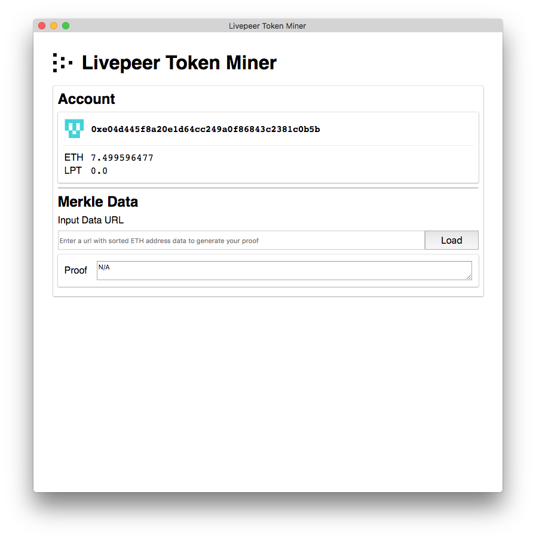
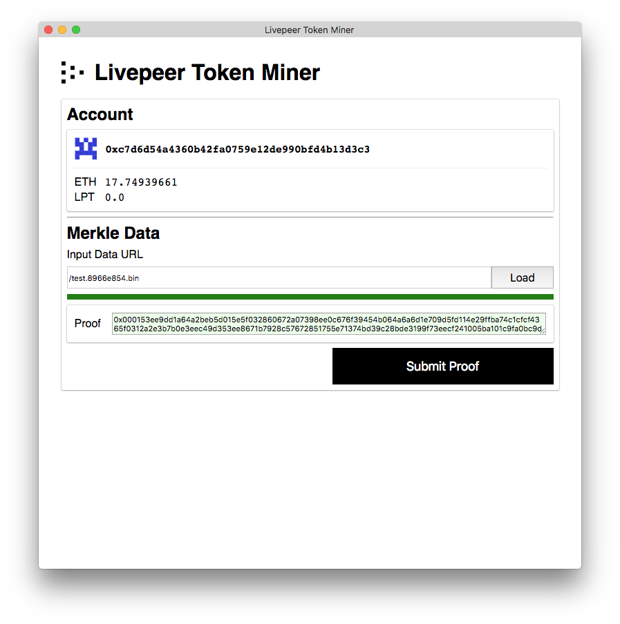
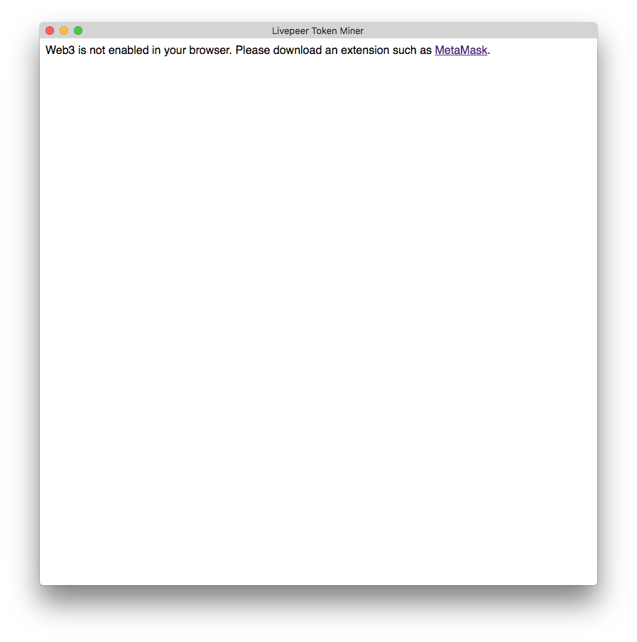
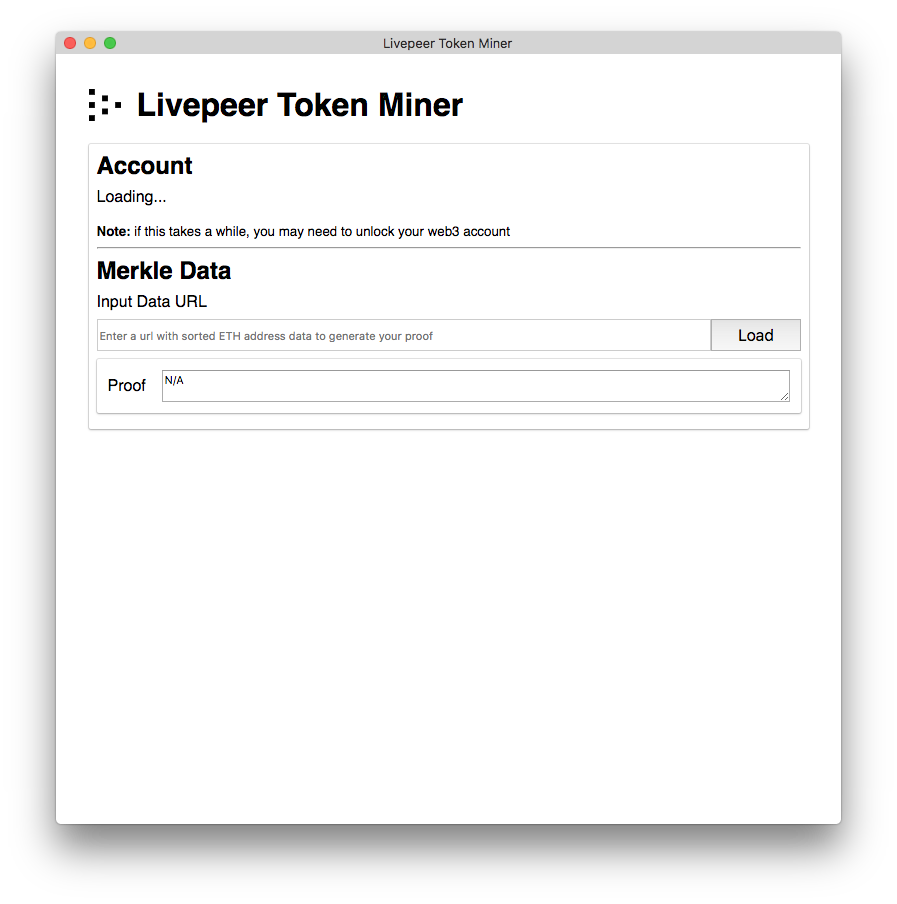
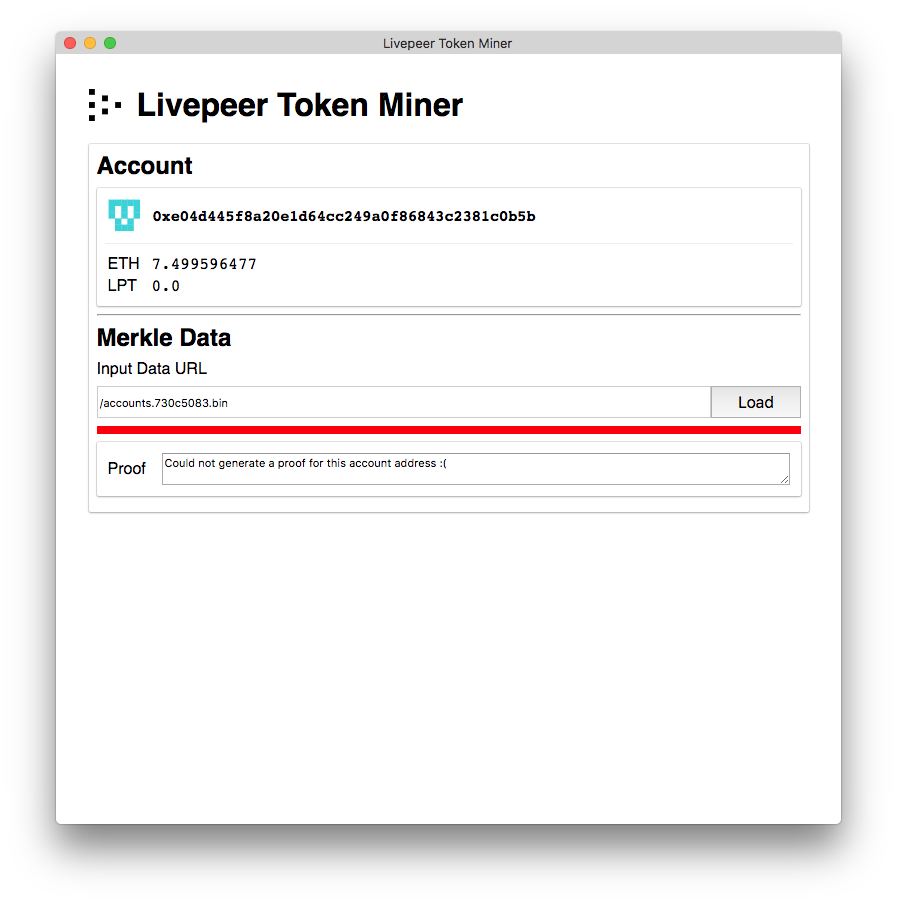

# Minecraft: Livepeer Token Miner

## Table of Contents

* [Getting Started](#getting-started)
* [How to Mine LPT](#how-to-mine-lpt)
* [Troubleshooting](#troubleshooting)

## Getting Started

To install dependencies and start this dApp locally, run the following command:

```
yarn && yarn start
```

## How to Mine LPT

### Step 1: Load Your Account

Once you are logged into web3 wallet, the Dapp will automatically pull in the address, ETH, and LPT balances for your wallet.



### Step 2: Load Merkle Input Data

Input the url for the data, a compressed binary of all account addresses sorted. This is a big file and will take a while to load.

Click Load, it will start loading data, and simultaneously generating proof. This will take a long time - its a 50mb file.

&nbsp;&nbsp;&nbsp;&nbsp;&nbsp;&nbsp;&nbsp;&nbsp;&nbsp;&nbsp;


Once loading completes, **and** if your selected account is eligible to mine, the proof will appear in the textarea below the url input.



### Step 3: Mine Your Token

You may now mine your LPT by clicking “Submit Proof”. Confirm your transaction details, submit, and once the transaction completes successfully, your LPT balance should show a value greater than “0.0”.

Congratulations, you’ve mined your token and may now participate as a delegator in the Livepeer protocol! 🎉

## Troubleshooting

* [It’s telling me Web3 is not enabled](#its-telling-me-web3-is-not-enabled)
* [My account never loads](#my-account-never-loads)
* [I couldn’t generate a proof](#i-couldnt-generate-a-proof)

### It’s telling me Web3 is not enabled.

In order to mine LPT, you will need to use a web3-enabled browser such as Mist or a browser extension such as MetaMask.



### My account never loads.

You may need to unlock your account through your browser extension or plugin.



### I couldn’t generate a proof.

Only account address with a balance >= .1 ETH prior at Ethereum block #5264265 are able to generate LPT through this dapp. If your address does not fit that criteria, you won’t be able to mine LPT with this dapp.



> **Note**: There is also a possibility the input data you are providing is incorrect or not sorted properly. If you think this may be the case, please refer to the mining specification for more information: https://github.com/livepeer/merkle-mine/blob/master/SPEC.md
